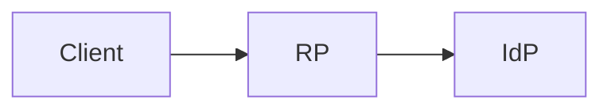
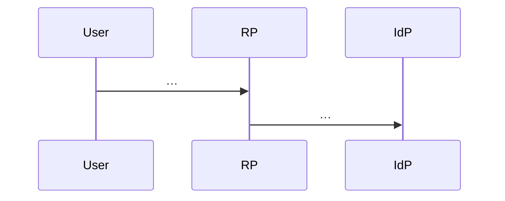

# <タイトル>

| 項目 | 内容 |
|------|------|
| Status | draft / in-review / accepted |
| Date | YYYY-MM-DD |
| Author | （任意） |
| Related | 関連 PRD・Issue・既存 doc へのパス |

## 1. 背景 / Context

なぜ今これをやるか。現状の問題・学びたいこと・前提。

## 2. Goals

- 達成したいこと（検証可能な文）

## 3. Non-goals

- やらないこと（スコープ外を明示）

## 4. 要件 / Requirements

### 4.1 機能要件

- [ ] …

### 4.2 非機能要件（ローカル前提）

本番 SLO やメトリクスは対象外。ローカル学習に必要な範囲だけ書く。

- 起動: どう起動するか（例: `go run` / docker compose、プロセス数）
- 依存: 外部 IdP を使うか、この repo 内で完結するか
- データ: 永続化の要否（メモリのみ / ファイル / DB）
- 設定: 環境変数や設定ファイルの要否（秘密は example のみ）

## 5. 現状（あれば）

既存コード・既存フローとの関係。新規なら「なし」でよい。

## 6. 提案アーキテクチャ

### 6.1 コンポーネント

| コンポーネント | 配置 (`services/…` or `pkg/…`) | 責務 |
|----------------|--------------------------------|------|
| … | … | … |

### 6.2 構成図（任意）

### 6.3 主要フロー

シーケンスやステップリスト。認証・認可ならトークン/セッションの受け渡しを明記。

### 6.4 インターフェース（案）

エンドポイント、メッセージ、共有型など実装に必要な契約。未決は Open Questions へ。

## 7. 意図的な弱さ / 学習ポイント（該当時のみ）

学習のために弱くする場合のみ記載。該当しなければセクション削除。

| 項目 | 弱い点 | 正しい対比 | 隔離方法（フラグ等） |
|------|--------|------------|----------------------|
| … | … | … | … |

## 8. 代替案

| 案 | 概要 | 採用/不採用 | 理由 |
|----|------|-------------|------|
| A（本命） | … | 採用 | … |
| B | … | 不採用 | … |

## 9. リスクと注意点

セキュリティ・誤用・学習上の誤解など。運用監視ではなく設計・実装上の注意。

- …

## 10. 受け入れ条件 / Acceptance Criteria

実装完了の判断基準。チェック可能であること。

- [ ] …
- [ ] ローカルで手順どおり起動し、主要フローを再現できる
- [ ] （意図的な弱さがある場合）ドキュメントまたはコメントで明示されている

## 11. 実装アウトライン

PR またはコミットのざっくり分割。依存順。

1. …
2. …
3. …

## 12. Open Questions

| # | 質問 | 選択肢 / メモ | 決める人 |
|---|------|---------------|----------|
| 1 | … | … | user |

## 13. 決定ログ / Key Decisions（埋まってきたら）

| 決定 | 理由 | 日付 |
|------|------|------|
| … | … | … |
