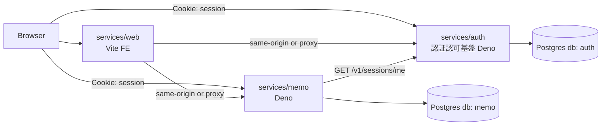
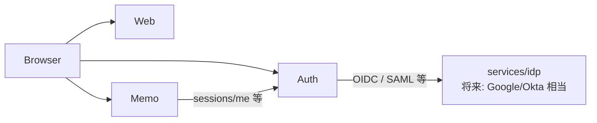
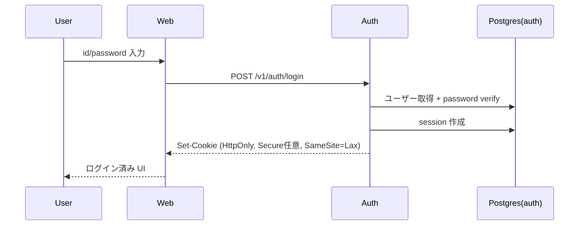
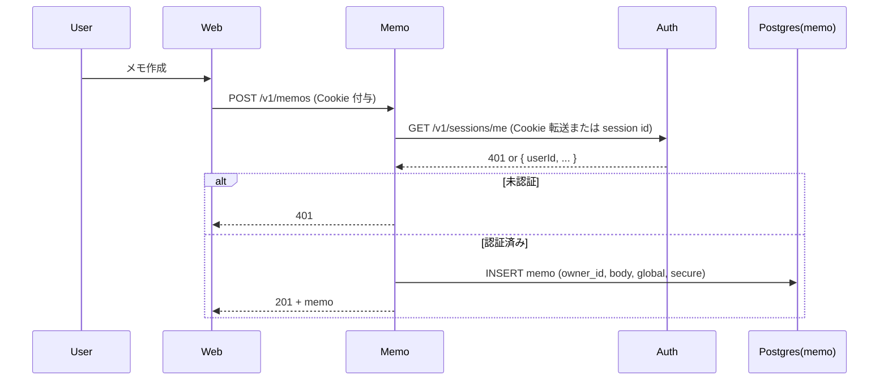
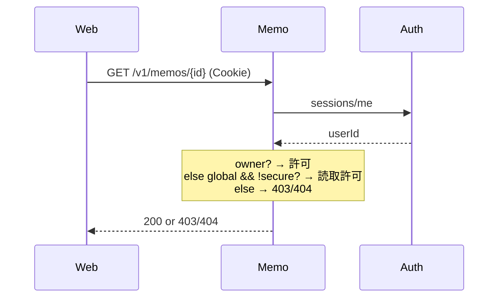

# 初回実装: 認証認可基盤 + メモ土台（Auth セッション + Memo API + FE）

| 項目 | 内容 |
|------|------|
| Status | draft |
| Date | 2026-07-18 |
| Related | `projects/first_commit/draft.md` |

## 1. 背景 / Context

本リポジトリは、企業で使われる水準の複雑・多様な認証認可を、手元で実装しながら学ぶ playground である。現状はディレクトリ骨格のみで、動くサービスは存在しない。

初回実装では「企業向けの完全な認証スイート」ではなく、**後続の OIDC / SAML / ステップアップ認証 / より複雑な認可を載せられる土台**を縦スライスで作る。具体的には:

- **アプリ側の認証認可基盤（Auth）** による id/password ログインとセッション Cookie  
  （Google / Okta 相当の **外部 IdP ではない**。後述）
- メモ（Markdown）の CRUD と、認可に効く属性（`global` / `secure`）
- TypeScript 一択（FE: Vite、BE: Deno）、契約は TypeSpec、DB は PostgreSQL + SafeQL
- すべて Docker 上で起動可能にし、mutation テストでテスト品質を担保する

### 用語: Auth と IdP の役割分担

| 名称 | 本 playground での意味 | 初回 |
|------|------------------------|------|
| **Auth**（`services/auth`） | **サービス側の認証認可基盤**。アプリユーザー・セッション・（将来）ポリシー連携の中心。Memo など RP/アプリが「今誰か」を問い合わせる先 | **実装する** |
| **IdP**（将来の `services/idp` 等） | Google / Okta に相当する **独立したアイデンティティプロバイダ**。OIDC / SAML を話し、Auth や各 RP にフェデレーションする | **作らない**（別 Design Doc） |

初回のログインは Auth が直接 id/password を検証する。将来 IdP を足したときも、**セッションの正やアプリ横断の認可ハブは Auth 側に残す**想定とし、IdP は「誰であるかの証明の供給源」に寄せる（詳細は後続設計）。

参照: 全体方針はルート `AGENTS.md` および `.grok/rules/`。

## 2. Goals

- Docker Compose で **Auth / Memo API / FE / PostgreSQL** を起動し、ブラウザからログイン〜メモ CRUD まで一通り再現できる
- ユーザー認証情報は **Auth が所有するマイクロサービス上の DB** に保存する（id/password）
- メモは Markdown 本文の CRUD ができ、`global` と `secure` を設定・永続化できる
- 認可の最小ルールを実装する:
  - 既定（非 global）: **所有者のみ** 読み書き
  - `global=true`: **ログイン済みユーザーなら誰でも読める**（書込は所有者のみ）
  - `secure=true`: **初回は所有者のみ**とし、将来の「追加認証（ステップアップ）」を前提にした属性として保持する（挙動の拡張は後続 Design Doc）
- FE/BE は TypeScript。BE は Deno。FE は Vite
- サービス間・FE 向け HTTP 契約は **TypeSpec** で定義し、クライアント/サーバ用 generator で型とボイラープレートを生成する
- DB は PostgreSQL。アプリからのクエリは **SafeQL** で型安全にする
- 主要ロジックに単体/結合テストを置き、**mutation テスト**でテストの抜けを検出できる

## 3. Non-goals

- **OpenID Provider / SAML IdP の実装**（Google・Okta 相当の独立 IdP サービス）
- OIDC / OAuth2 Authorization Code によるフェデレーション、外部 SaaS IdP 連携
- MFA / WebAuthn / ステップアップ認証の実装本体（`secure` フラグの「将来要件」としてのデータモデルとドキュメントのみ）
- RBAC/ABAC の本格エンジン、ポリシー言語、SpiceDB 等の外部認可サービス
- メモ本文の at-rest 暗号化、E2E 暗号化
- 本番運用設計（マルチリージョン、SLO、集中監視、アラート）
- 未ログインユーザー向けの完全公開メモ（匿名 read）。`global` は **認証済みユーザー間** の共有に限定する
- モバイルアプリ、SSR フレームワーク（Next 等）の採用
- GraphQL / gRPC（初回は HTTP/JSON）

## 4. 要件 / Requirements

### 4.1 機能要件

**認証認可基盤（Auth）**

- [ ] ユーザー登録（最低限: ローカル開発用のシード、または簡易 signup API）
- [ ] id（または email）+ password によるログイン
- [ ] ログイン成功時に **HttpOnly セッション Cookie** を発行する
- [ ] ログアウトでセッションを無効化する
- [ ] セッション検証 API（Memo / FE から「今誰か」を確認できる）
- [ ] password は平文保存しない（パスワードハッシュ: 例 argon2id または bcrypt）

**メモ（Memo API）**

- [ ] ログイン済みユーザーがメモを作成・一覧・取得・更新・削除できる
- [ ] 本文は Markdown 文字列として保存する（サーバ側レンダリングは必須ではない）
- [ ] 各メモに `global: boolean` と `secure: boolean` を持てる
- [ ] 認可:
  - 所有者: 常に CRUD 可
  - 非所有者 + `global=true`: **読取のみ** 可
  - 非所有者 + `global=false`: 404 または 403（実装で統一し文書化）
  - `secure=true`: 初回は所有者以外のアクセスを許可しない（`global` との同時 true の解釈は §6.5）
- [ ] 未認証リクエストは 401

**FE（Web）**

- [ ] ログイン / ログアウト UI
- [ ] メモ一覧・作成・編集・削除 UI（Markdown の plain textarea で可。プレビューは任意）
- [ ] `global` / `secure` のトグルを作成・編集画面で設定できる
- [ ] 他ユーザーの `global` メモを読める画面または一覧フィルタがある

### 4.2 非機能要件（ローカル前提）

| 項目 | 内容 |
|------|------|
| 起動 | `docker compose up` 一発（または root の簡易スクリプト）。ローカル直接 `deno task` / `vite` も可能にする |
| プロセス | `auth`（Deno）、`memo`（Deno）、`web`（Vite dev または静的配信）、`postgres` |
| 依存 | すべて repo 内。外部 SaaS IdP は使わない |
| データ | PostgreSQL に永続化。ボリュームで compose 再起動後も残す |
| 設定 | 環境変数（`DATABASE_URL`、Cookie 名、サービス URL 等）。秘密は `.env.example` のみコミット |
| 契約生成 | TypeSpec → TS クライアント / サーバ stubs。CI または `task generate` で再生成可能 |
| テスト | Deno テスト +（必要なら）compose 上の結合テスト。mutation: Stryker 相当を TS パッケージに適用 |
| ポート（案） | Auth `3001`、Memo `3002`、Web `5173`、Postgres `5432`（ホスト公開は学習用） |

## 5. 現状（あれば）

なし。`services/`・`pkg/`・`docs/` は空に近い骨格のみ。既存認証実装・既存 API 契約はない。

## 6. 提案アーキテクチャ

### 6.1 コンポーネント

| コンポーネント | 配置 | 責務 |
|----------------|------|------|
| TypeSpec 契約 | `doc/`（repo 直下） | Auth / Memo の HTTP API 定義。生成物のソース・オブ・トゥルース |
| 生成クライアント等 | `pkg/api-client/` など | TypeSpec generator 出力。FE・サービスから参照 |
| 共有ユーティリティ | `pkg/`（必要最小限） | 例: Cookie 名定数、エラー型。**ビジネスロジックは置かない**。`pkg` → `services` 依存は禁止 |
| **Auth**（認証認可基盤） | `services/auth/` | アプリユーザー、パスワード検証、セッション発行/破棄/検証。将来の認可拡張の受け皿 |
| Memo API | `services/memo/` | メモ CRUD、メモ認可、Auth へのセッション検証呼び出し |
| Web FE | `services/web/` | Vite + TypeScript UI |
| PostgreSQL | compose サービス `db` | 永続化。DB 分離（下記） |
| Compose / 開発基盤 | repo ルート | `docker-compose.yml`、`.env.example`、root タスク |
| **IdP**（将来） | 例: `services/idp/`（未作成） | OIDC/SAML を話す独立 IdP。Auth とは別サービス | 

**命名注意**: ディレクトリ・compose サービス名に `idp` を使わない。後続の Google/Okta 相当と混同しないため。

**DB 分割方針（採用）**: 単一 Postgres インスタンス、**データベースを分ける**（`auth` DB / `memo` DB）。サービス境界を明確にし、安易な cross-join を防ぐ。同一 compose ネットワーク上で接続する。

### 6.2 ファイル構成

初回実装後のリポジトリ骨格（案）。実装時にファイル名を微調整してよいが、**トップレベルと `services/` / `pkg/` / `doc/` の境界は守る**。

```
authz_playgrounds/
├── AGENTS.md
├── README.md                    # 起動手順の入口
├── .env.example                 # 秘密は書かない。接続先・ポート例のみ
├── .gitignore
├── docker-compose.yml           # auth / memo / web / db
├── package.json                 # 任意: monorepo ルート scripts（generate 等）
├── deno.json                    # 任意: workspace 用（各サービスに置く場合は省略可）
│
├── projects/                    # 企画・設計（コードではない）
│   └── first_commit/
│       ├── draft.md
│       └── design.md            # 本ドキュメント
│
├── docs/                        # 学習メモ・実装後の解説（Design Doc 置き場ではない）
│
├── doc/                         # TypeSpec ソース・オブ・トゥルース + 生成 OpenAPI
│   ├── main.tsp
│   ├── tspconfig.yaml           # generator 設定
│   ├── common/
│   │   └── errors.tsp
│   ├── auth/
│   │   ├── auth.tsp             # register / login / logout
│   │   ├── sessions.tsp         # sessions/me
│   │   └── users.tsp            # 必要なら
│   ├── memo/
│   │   └── memos.tsp
│   └── openapi/
│       └── openapi.yaml         # tsp emit 成果物
│
├── pkg/                         # 共有のみ。services への依存禁止
│   ├── api-client/              # TypeSpec 生成クライアント（コミットする）
│   │   ├── mod.ts               # または package 入口
│   │   ├── auth/
│   │   └── memo/
│   └── shared/                  # 定数・小さな型のみ（任意）
│       └── cookie.ts            # Cookie 名など
│
├── infra/                       # compose 補助（任意だが推奨）
│   └── postgres/
│       └── init/
│           └── 01-create-databases.sql   # CREATE DATABASE auth; memo;
│
├── services/
│   ├── auth/                    # 認証認可基盤（Deno）
│   │   ├── deno.json
│   │   ├── Dockerfile
│   │   ├── README.md
│   │   ├── .env.example
│   │   ├── src/
│   │   │   ├── main.ts          # HTTP サーバ起動
│   │   │   ├── env.ts
│   │   │   ├── routes/
│   │   │   │   ├── auth.ts      # login / logout / register
│   │   │   │   └── sessions.ts  # me
│   │   │   ├── domain/
│   │   │   │   ├── user.ts
│   │   │   │   ├── session.ts
│   │   │   │   └── password.ts  # hash / verify
│   │   │   ├── db/
│   │   │   │   ├── client.ts    # postgres 接続
│   │   │   │   ├── users.ts     # SafeQL クエリ
│   │   │   │   └── sessions.ts
│   │   │   └── generated/       # TypeSpec サーバ側生成物（任意）
│   │   ├── migrations/
│   │   │   └── 001_init.sql
│   │   └── tests/
│   │       ├── password_test.ts
│   │       ├── session_test.ts
│   │       └── auth_http_test.ts
│   │
│   ├── memo/                    # メモ API（Deno）
│   │   ├── deno.json
│   │   ├── Dockerfile
│   │   ├── README.md
│   │   ├── .env.example
│   │   ├── src/
│   │   │   ├── main.ts
│   │   │   ├── env.ts
│   │   │   ├── routes/
│   │   │   │   └── memos.ts
│   │   │   ├── domain/
│   │   │   │   ├── memo.ts
│   │   │   │   └── authorize.ts # owner / global / secure 行列
│   │   │   ├── clients/
│   │   │   │   └── auth.ts      # Auth sessions/me 呼び出し
│   │   │   ├── db/
│   │   │   │   ├── client.ts
│   │   │   │   └── memos.ts
│   │   │   └── generated/
│   │   ├── migrations/
│   │   │   └── 001_init.sql
│   │   └── tests/
│   │       ├── authorize_test.ts
│   │       └── memos_http_test.ts
│   │
│   └── web/                     # FE（Vite + TypeScript）
│       ├── package.json
│       ├── vite.config.ts       # proxy: /api/auth → auth, /api/memo → memo
│       ├── tsconfig.json
│       ├── index.html
│       ├── Dockerfile           # dev または静的配信
│       ├── README.md
│       └── src/
│           ├── main.ts
│           ├── App.tsx          # または .ts + 軽量 UI（フレームワークは実装時決定可）
│           ├── api/
│           │   └── client.ts    # pkg/api-client を利用
│           ├── pages/
│           │   ├── LoginPage.tsx
│           │   ├── MemoListPage.tsx
│           │   └── MemoEditPage.tsx
│           └── components/
│               └── MemoFlags.tsx  # global / secure トグル
│
└── tools/                       # 任意
    ├── generate.sh              # TypeSpec → pkg/api-client
    └── mutate.sh                # mutation テスト起動
```

#### 配置ルール（要約）

| 置き場 | 置くもの | 置かないもの |
|--------|----------|--------------|
| `services/<name>/` | そのサービス固有のルート・DB・Dockerfile・テスト | 他サービス実装の import |
| `pkg/` | 生成クライアント、サービス横断の薄い定数/型 | 認可ビジネスロジック、DB アクセス |
| `doc/` | TypeSpec 定義のみ | ランタイム実装 |
| `projects/` | draft / design | 実行コード |
| `docs/` | 学習メモ・解説 | 初回の Design Doc（本ファイルは `projects/`） |
| repo ルート | compose、`.env.example`、全体 README | サービス固有ロジック |

#### 依存の向き

```
services/web  ──imports──►  pkg/api-client  ◄──generate──  doc/
services/memo ──imports──►  pkg/api-client（任意）
services/memo ──HTTP────►  services/auth     （コード依存ではなく実行時）
services/*    ──禁止────►  他 services/* のソース import
pkg/*         ──禁止────►  services/*
```

### 6.3 構成図

**初回（本 Design Doc の範囲）**



**将来イメージ（非ゴール・参考）**



IdP 追加後も Memo は原則 **Auth だけ** を見続け、プロトコル差分は Auth に閉じ込める。

**ブラウザからの API 到達（採用）**: 開発時は Vite dev server の **proxy** で `/api/auth/*` → Auth、`/api/memo/*` → Memo に転送し、**同一オリジン + Cookie** を成立させる。本番相当の静的配信時は Caddy/nginx 等の reverse proxy を compose に足してもよいが、初回は Vite proxy で十分。

### 6.4 主要フロー

#### 6.4.1 ログイン



#### 6.4.2 メモ作成（認証付き）



#### 6.4.3 メモ読取の認可



**セッション受け渡し**: ブラウザは Auth 発行の Cookie を保持する。Memo はリクエストの Cookie を Auth の `sessions/me` に転送して検証する（サーバ間 HTTP）。共有セッションテーブルを Memo が直接読む方式は、サービス境界が曖昧になるため **初回は不採用**。

### 6.5 インターフェース（案）

TypeSpec のディレクトリと生成先は §6.2 のツリーを正とする。以下は HTTP 契約の中身。

#### Auth API（案）

| Method | Path | 説明 |
|--------|------|------|
| `POST` | `/v1/auth/register` | 開発用ユーザー登録（login_id + password） |
| `POST` | `/v1/auth/login` | ログイン → Set-Cookie |
| `POST` | `/v1/auth/logout` | セッション破棄 |
| `GET` | `/v1/sessions/me` | 現在のセッションユーザー。未認証は 401 |

Cookie 名（案）: `playground_session`  
属性: `HttpOnly; Path=/; SameSite=Lax`（ローカル HTTP では `Secure` は付けないか、HTTPS 終端時のみ）

#### Memo API（案）

| Method | Path | 説明 |
|--------|------|------|
| `GET` | `/v1/memos` | 自分が所有するメモ + （query で）読める global メモ |
| `POST` | `/v1/memos` | 作成 `{ title?, body, global?, secure? }` |
| `GET` | `/v1/memos/{id}` | 取得（認可チェック） |
| `PATCH` | `/v1/memos/{id}` | 更新（所有者のみ） |
| `DELETE` | `/v1/memos/{id}` | 削除（所有者のみ） |

**リソース形（案）**

```ts
type Memo = {
  id: string;          // UUID
  ownerId: string;     // Auth が発行する app user id
  title: string;
  body: string;        // Markdown
  global: boolean;
  secure: boolean;
  createdAt: string;   // ISO-8601
  updatedAt: string;
};
```

#### `global` / `secure` の意味（初回確定）

| フラグ | 意味 | 初回の挙動 |
|--------|------|------------|
| `global=false`, `secure=false` | 通常のプライベートメモ | 所有者のみ CRUD |
| `global=true`, `secure=false` | 認証済みユーザーに公開（読取） | 所有者: CRUD / 他ユーザー: 読取のみ |
| `secure=true`（`global` 任意） | **将来、追加認証を要求するメモ** | 初回は **所有者のみ** アクセス可。`global=true` かつ `secure=true` でも他ユーザー読取は **許可しない**（ステップアップ実装後に「global だが追加認証後に読める」等へ拡張する余地を残す） |

学習ポイントとして、API レスポンスや FE 上で `secure` メモには「追加認証が将来必要」と表示してよい。

#### DB スキーマ（案）

**auth**

```sql
-- users
id UUID PK
login_id TEXT UNIQUE NOT NULL   -- ログインに使う ID
password_hash TEXT NOT NULL
created_at TIMESTAMPTZ NOT NULL

-- sessions
id UUID PK                      -- セッション ID（Cookie 値と対応）
user_id UUID NOT NULL REFERENCES users(id)
expires_at TIMESTAMPTZ NOT NULL
created_at TIMESTAMPTZ NOT NULL
```

**memo**

```sql
-- memos
id UUID PK
owner_id UUID NOT NULL          -- Auth user id（論理 FK。DB 横断のため物理 FK は張らない）
title TEXT NOT NULL DEFAULT ''
body TEXT NOT NULL DEFAULT ''
is_global BOOLEAN NOT NULL DEFAULT false
is_secure BOOLEAN NOT NULL DEFAULT false
created_at TIMESTAMPTZ NOT NULL
updated_at TIMESTAMPTZ NOT NULL
```

#### SafeQL

- 各 Deno サービスで PostgreSQL へクエリする箇所に SafeQL を適用する
- 接続先はサービスごとの DB
- セットアップは「マイグレーション適用済みのローカル/CI DB に対して型を取る」方式とし、手順を `services/*/README` または `docs/` に短く書く
- Deno 上での具体的な配線（eslint 併用 / 専用タスク）は実装時に最小構成で決め、動けばよい（Open Questions に残す細部）

#### テスト / Mutation

| 層 | 方針 |
|----|------|
| Auth 単体 | password 検証、セッション有効期限、未認証 |
| Memo 単体 | 認可行列（owner / other × global × secure）を表で固定 |
| 結合 | compose 起動後に login → CRUD を打つスクリプトまたは Deno test |
| Mutation | 認可分岐・password 検証など重要パスに Stryker（または同等）をかけ、mutation score の下限を package ごとに設定（初回は「回る」こと優先、閾値は緩くてよい） |

## 7. 意図的な弱さ / 学習ポイント

初回は「正しく動く最小実装」を目指す。意図的に脆弱なパターンは **入れない**。

学習ポイント（弱さではない）:

| 項目 | 内容 |
|------|------|
| Auth と IdP の分離 | 初回は Auth が id/password を直接持つ。後で IdP を足すと「証明の供給」と「アプリセッション/認可」が分かれる |
| セッションのサービス間検証 | Memo が Auth に introspect する方式のレイテンシと障害伝播 |
| `secure` の先送り | フラグだけ先に置き、ステップアップを後続で足すと認可分岐がどう増えるか |
| `global` と IDOR | 非所有者読取の許可条件をテストで固定しないと壊れやすい |
| Cookie + 複数サービス | 同一サイト proxy 前提。安易に `SameSite=None; Secure` や CORS `*` に逃げない |

将来、意図的な脆弱版（例: IDOR を残したブランチ）を足す場合は、ファイル先頭コメントと Design Doc で明示する（`AGENTS.md` 準拠）。

## 8. 代替案

| 案 | 概要 | 採用/不採用 | 理由 |
|----|------|-------------|------|
| A. Auth セッション Cookie + Memo が Auth に検証委譲 | 本ドキュメントの本命 | **採用** | アプリ側基盤として境界が明確。後から独立 IdP を足しやすい |
| B. 初回コンポーネントを `idp` と名付ける | ディレクトリ `services/idp` | **不採用** | Google/Okta 相当と混同する。本サービスは OP/SAML IdP ではない |
| C. 共有セッションテーブルを Memo が直接参照 | 同一 DB の sessions を読む | 不採用 | Auth データへの他サービス直アクセスが境界を壊す |
| D. ログイン後 JWT を FE が保持し Bearer 送信 | Cookie なし | 不採用（初回） | XSS 時のリスクとトークン保存の論点が別。Cookie セッションの方がブラウザアプリの定番学習に合う |
| E. 初回から OIDC Authorization Code + 独立 IdP | 標準プロトコル一式 | 不採用（初回） | スコープ过大。土台（Auth）の後に別 Design Doc |
| F. 認証+メモのモノリス Deno | 1 プロセス | 不採用 | draft のマイクロサービス前提と、認可境界の学習に不向き |
| G. `secure` を at-rest 暗号化と解釈 | 本文暗号化 | 不採用 | ユーザー意図は「後で追加認証」。暗号化は別課題 |

## 9. リスクと注意点

- **用語の混同**: ドキュメント・コードコメントで Auth を「IdP」と呼ばない。将来の独立 IdP 追加時に設計がねじれる
- **Cookie の Domain/Path と proxy 設定ミス**で「ログインしたのに Memo が 401」になりやすい。compose と Vite proxy をセットで文書化する
- **Auth ダウン時に Memo が全停止**する。初回は許容し、キャッシュや署名付きセッションは後続検討
- **`owner_id` に物理 FK が無い**ため、存在しないユーザー ID の混入はアプリ側で防ぐ（常に `sessions/me` の id のみ使用）
- **SafeQL + Deno** のエコシステム相性でセットアップが難航する可能性。最悪「postgres.js + 手書き型」に一時フォールバックし、Open Questions を更新する
- **mutation テストは重い**。ローカルでは変更パッケージのみ、CI では nightly または main のみ、など段階導入を許容する
- **秘密情報**（DB パスワード等）をコミットしない。シードユーザーのパスワードは example のみ
- TypeSpec 生成物をコミットするか CI 生成するかで差分ノイズが変わる。初回は **生成物コミット** を推奨（clone 直後に生成ツール不要で動く）

## 10. 受け入れ条件 / Acceptance Criteria

- [ ] `docker compose up`（またはドキュメント記載の同等手順）で Auth / Memo / Web / Postgres が起動する
- [ ] サービス名/パスが `auth` であり、`idp` と命名されていない（将来の独立 IdP 用に名前を空けている）
- [ ] ユーザーを登録（またはシード）し、id/password でログインできる
- [ ] ログイン後、メモの作成・一覧・取得・更新・削除ができる
- [ ] メモに `global` / `secure` を設定して保存・再表示できる
- [ ] ユーザー A の非 global メモをユーザー B が取得できない
- [ ] ユーザー A の `global=true` かつ `secure=false` メモをユーザー B が **読める**（更新・削除はできない）
- [ ] `secure=true` のメモは所有者以外が読めない（`global=true` でも同様）
- [ ] 未ログインで保護 API を叩くと 401
- [ ] password が DB に平文で保存されていない
- [ ] FE は Vite + TypeScript、BE は Deno + TypeScript である
- [ ] TypeSpec から生成したクライアント/型を FE またはサービスが利用している
- [ ] PostgreSQL を使用し、アプリの主要クエリに SafeQL（または Design Doc 更新済みの代替）を用いている
- [ ] 認可および認証の重要パスに自動テストがあり、mutation テストを実行できる（スコア閾値は初期は緩可）
- [ ] 秘密鍵・本番相当パスワードが git に含まれない
- [ ] README または `docs/` にローカル起動手順と主要フローが書かれている
- [ ] ドキュメント上で Auth（アプリ基盤）と将来 IdP（Google/Okta 相当）の違いが説明されている

## 11. 実装アウトライン

依存順のざっくり分割（PR 単位の目安）。

1. **リポジトリ基盤**  
   compose（Postgres 2 DB または init script）、`.env.example`、ディレクトリ骨格、共通タスクランナー方針

2. **TypeSpec 契約**  
   Auth / Memo の HTTP 定義、generator 設定、`pkg/api-client` への出力、生成物の利用サンプル

3. **Auth（認証認可基盤）**  
   マイグレーション、ユーザー+セッション、login/logout/me、パスワードハッシュ、Deno テスト

4. **Memo API**  
   マイグレーション、CRUD、Auth セッション検証クライアント、認可行列テスト

5. **SafeQL 配線**  
   両サービスでクエリ型付け。無理ならフォールバックを明記して継続

6. **Web FE**  
   Vite、proxy（`/api/auth`, `/api/memo`）、ログイン、メモ UI、フラグトグル、生成クライアント利用

7. **Mutation テスト**  
   重要パッケージに導入、実行スクリプト、初期閾値

8. **ドキュメント締め**  
   起動手順、Auth と将来 IdP の用語、`secure` の将来拡張メモ、受け入れ条件の自己チェック

## 12. Open Questions

| # | 質問 | 選択肢 / メモ | 決める人 |
|---|------|---------------|----------|
| 1 | ログイン識別子は `email` か任意の `login_id` か | 初回は `login_id`（email 形式強制なし）を提案 | user（異存なければ提案採用） |
| 2 | ユーザー登録 API を公開するか、シードのみか | 学習用に register あり + compose シードの両方を提案 | user |
| 3 | `GET /memos` の一覧に他者 global を含めるか | `?scope=mine\|readable` などで明示を提案 | user |
| 4 | SafeQL を Deno で詰んだ場合のフォールバック | 手書き型 + 実行時検証を許容するか | user |
| 5 | mutation ツール固定 | StrykerJS 想定。Deno との相性で別ツール可 | 実装時に決定可 |
| 6 | ステップアップ認証の方式（後続） | WebAuthn / 再パスワード / TOTP 等。初回スコープ外 | 後続 Design Doc |
| 7 | サービスディレクトリ名 | `services/auth` を提案。`authz` / `platform-auth` 等の別名希望があれば | user（異存なければ `auth`） |

## 13. 決定ログ / Key Decisions

| 決定 | 理由 | 日付 |
|------|------|------|
| 初回の認証主体は **Auth（サービス側認証認可基盤）** であり、IdP ではない | IdP は後続で Google/Okta 相当として独立実装する | 2026-07-18 |
| 配置は `services/auth`（`services/idp` は使わない） | 将来の独立 IdP と名前が衝突しないようにする | 2026-07-18 |
| 認証は Auth セッション Cookie。Memo は Auth に検証委譲 | 薄い縦スライスでサービス境界を保つ | 2026-07-18 |
| 構成は Auth + Memo + FE + Postgres | draft のマイクロサービス + 最小分割 | 2026-07-18 |
| 企業級の複雑な認可・OIDC/SAML IdP は後続。初回は id/password + メモ認可 | 土台を先に安定させる | 2026-07-18 |
| `global` = 認証済みユーザー間の読取共有 | ユーザー指定。匿名公開は非ゴール | 2026-07-18 |
| `secure` = 将来の追加認証用属性。初回は所有者のみ | ユーザー指定（後で追加認証）。初回から暗号化はしない | 2026-07-18 |
| `global && secure` でも他者読取不可（初回） | ステップアップ未実装の安全側デフォルト | 2026-07-18 |
| BE: Deno / FE: Vite / 契約: TypeSpec / DB: PostgreSQL + SafeQL | draft 受け入れ条件 | 2026-07-18 |
| 意図的な脆弱実装は初回に含めない | 正しい土台を先に作る | 2026-07-18 |

## PR Plan

実装アウトライン（§11）を実行可能な PR 単位に分割した。依存は厳密に守り、同一レベルは並列実行可能。

### PR 1: Repository foundation (compose, env, skeleton)

- **Files/components affected:** docker-compose.yml, .env.example, .gitignore, README.md, infra/postgres/init/01-create-databases.sql, services/auth/.gitkeep, services/memo/.gitkeep, services/web/.gitkeep, pkg/.gitkeep, doc/.gitkeep, docs/.gitkeep
- **Dependencies:** None
- **Description:** Docker Compose で Postgres（auth/memo 2 DB init）、auth/memo/web サービス骨格、`.env.example`、`.gitignore`、ルート README の起動入口を置く。サービス固有ロジックは入れない。DB 分割とポート案（Auth 3001 / Memo 3002 / Web 5173 / Postgres 5432）を反映する。

### PR 2: TypeSpec contracts and generated api-client

- **Files/components affected:** doc/main.tsp, doc/tspconfig.yaml, doc/common/errors.tsp, doc/auth/auth.tsp, doc/auth/sessions.tsp, doc/memo/memos.tsp, pkg/api-client/, tools/generate.sh, package.json (optional root generate scripts)
- **Dependencies:** PR 1
- **Description:** Auth（register/login/logout/sessions/me）と Memo CRUD の HTTP 契約を TypeSpec で定義し、generator で `pkg/api-client` に TS クライアント/型を生成してコミットする。生成手順を `tools/generate.sh` に固定する。

### PR 3: Auth service (users, sessions, password hash)

- **Files/components affected:** services/auth/
- **Dependencies:** PR 2
- **Description:** Deno の Auth サービス実装。マイグレーション（users/sessions）、argon2id または bcrypt による password hash、register/login/logout、HttpOnly Cookie `playground_session`、GET /v1/sessions/me、Dockerfile、単体/HTTP テスト。SafeQL 可能なら配線、無理なら手書き型 + フォールバックを README に明記。

### PR 4: Memo API (CRUD + authorization matrix)

- **Files/components affected:** services/memo/
- **Dependencies:** PR 2, PR 3
- **Description:** Deno の Memo API。マイグレーション、CRUD、Cookie 転送で Auth sessions/me 呼び出し、owner/global/secure 認可行列、Dockerfile、authorize 行列テストと HTTP テスト。未認証 401。`global&&secure` は他者読取不可。

### PR 5: Web FE (Vite, proxy, login, memo UI)

- **Files/components affected:** services/web/
- **Dependencies:** PR 2, PR 3, PR 4
- **Description:** Vite + TypeScript FE。proxy（/api/auth → auth, /api/memo → memo）、ログイン/ログアウト、メモ一覧・作成・編集・削除、global/secure トグル、他ユーザー global メモの読取 UI。`pkg/api-client` 利用。Dockerfile。

### PR 6: Mutation tests and documentation wrap-up

- **Files/components affected:** tools/mutate.sh, services/auth/tests or mutation config, services/memo/ mutation config, docs/, README.md
- **Dependencies:** PR 3, PR 4, PR 5
- **Description:** 認可・password 検証など重要パスに mutation テスト（Stryker または同等）を導入し実行スクリプトを置く。README/docs に起動手順、Auth と将来 IdP の用語差、`secure` の将来拡張、受け入れ条件の自己チェックを書く。
